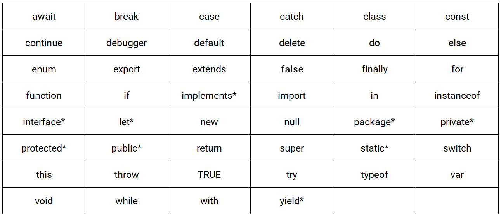

# 04장 변수

## 4.1 변수란 무엇인가? 왜 필요한가?

### 변수

하나의 값을 저장하기 위해 확보한 메모리 공간 자체 또는 그 메모리 공간을 식별하기 위해 붙인 이름.

> **메모리**  
> - 데이터를 저장할 수 있는 메모리 셀의 집합체  
> - 메모리 셀 하나의 크기는 **1바이트(8비트)**, 1바이트 단위로 데이터를 저장하거나 읽어들임.  
> - 각 셀은 고유의 메모리 주소를 가지며, 메모리 주소는 메모리 공간의 위치를 나타냄.  
> - 0부터 시작해서 메모리의 크기만큼 정수만큼 표현됨.

### 변수가 필요한 이유

```js
10 + 20;
```

- 위 예제의 숫자 10과 20은 메모리 상의 임의의 위치(메모리 주소)에 기억(저장)되고, CPU는 이 값을 읽어 들여 연산을 수행함. 
- 연산 결과로 생성된 숫자 값 30 역시 메모리 상의 임의의 위치에 저장됨. -> 그러나 연산 결과를 재사용하지 못함.
- 재사용하려면 메모리 주소를 통해 30이 저장된 메모리 공간에 직접 접근해야하지만, 그러면 치명적 오류를 발생시킬 가능성이 높음 -> 이때 변수를 사용해 메모리 공간에 저장된 값 30을 다시 읽어 들여 재사용할 수 있음 

**변수는 프로그래밍 언어의 컴파일러 또는 인터프리터에 의해 값이 저장된 메모리 공간의 주소로 치환되어 실행됨**

**변수에 여러 개의 값을 저장하는 방법**

- 변수는 하나의 값을 저장하기 위한 매커니즘
- 여러 개의 값을 저장하려면 여러 개의 변수를 사용해야 함
- 배열이나 객체 같은 자료구조를 사용하면 여러 개의 값을 그룹화해서 하나의 값처럼 사용 가능.
  ```js
  var userId = 1;
  var user = { id: 1, name: "Kim" };
  var users = [
    { id: 1, name: "Kim" },
    { id: 2, name: "Lee" }
  ];
  ```

**변수 이름** : 메모리 공간에 저장된 값을 식별할 수 있는 고유한 이름   
**변수값** : 변수에 저장된 값   
**할당(대입, 저장)** : 변수에 값을 저장하는 것   
**참조** : 변수에 저장된 값을 읽어 들이는 것 
```js
  var result = 10 + 20;
  result // 30
```

## 4.2 식별자

### 식별자 
- 어떤 값을 구별해서 식별할 수 있는 고유한 이름 (ex. 변수, 함수, 클래스 등)  
- 값이 아니라 **메모리 주소**를 기억함.  
- **네이밍 규칙**을 준수해야 하며, **선언**에 의해 자바스크립트 엔진에 식별자의 존재를 알림.

## 4.3 변수 선언

### 변수 선언 
- 변수를 생성하는 것
- 값을 저장하기 위한 메모리 공간을 확보하고 변수 이름과 확보된 메모리 공간의 주소를 연결해서 값을 저장할 수 있게 준비하는 것
- 변수를 사용하려면 반드시 선언이 필요함.
- 변수를 선언할 때는 `var`, `let`, `const` 키워드 사용

  > **ES5 vs. ES6**  
  > ES6는 기본적으로 하위 호환성을 유지하면서 ES5의 기반 위에 새로운 기능을 추가한 것  
  > ES6는 ES5의 상위 집합  
  > ex. `var`의 단점을 보완하기 위해 ES6에 `let`, `const` 도입함

var 키워드는 뒤에 오는 변수 이름으로 새로운 변수를 선언할 것을 지시하는 키워드.

```js
var score;
```

> **키워드** : 자바스크립트 코드를 해석하고 실행하는 자바스크립트 엔진이 수행할 동작을 규정한 일종의 명렁어

자바스크립트 엔진은 **변수 선언**을 아래와 같이 2단계에 거쳐 수행한다.
- **선언 단계** : 변수 이름을 등록해서 자바스크립트 엔진에 변수의 존재를 알린다.
- **초기화 단계** : 값을 저장하기 위한 메모리 공간을 확보하고 암묵적으로 `undefined`를 할당해 초기화한다. 
> **초기화** : 변수가 선언된 이후 최초로 값을 할당하는 것  

> **undefined** : 자바스크립트에서 제공하는 원시타입의 값 

#### 변수 이름은 어디에 등록되는가?
- 변수 이름을 비롯한 모든 식별자는 **실행 컨텍스트**에 등록함.   
- 자바스크립트 엔진은 실행 컨텍스트를 통해 **식별자**와 **스코프**를 관리함.   
- 변수 이름과 변수 값은 실행 컨텍스트 내에 **객체**로 등록되어 관리됨. 
> **실행 컨텍스트** : 자바스크립트 엔진이 소스코드를 평가하고 실행하기 위해 필요한 환경을 제공하고 코드의 실행 결과를 실제로 관리하는 영역   

만약 선언하지 않은 식별자에 접근하면 `ReferenceError`(참조 에러)가 발생한다.

> **ReferenceError** : 식별자를 통해 값을 참조하려 했지만 자바스크립트 엔진이 등록된 식별자를 찾을 수 없을 떄 발생하는 에러

## 4.4 변수 선언의 실행 시점과 변수 호이스팅 
```js
console.log(score); // undefined
var score; // 변수 선언문 
```
#### `console.log(score)`이 실행되는 시점은 아직 변수가 선언되지 않았는데, 참조 에러가 아닌 `undefined`가 출력되는 이유?   
  - 변수 선언은 소스코드가 한 줄씩 순차적으로 실행되는 시점, 즉 런타임이 아니라 그 이전 단계에서 먼저 실행되기 때문 -> **변수 호이스팅**   

### 변수 호이스팅
- 변수 선언문이 코드의 선두로 끌어 올려진 것처럼 동작하는 자바스크립트 고유의 특징
- 변수 선언이 소스코드 위치 상관없이 어디서든지 변수를 참조할 수 있다. 
- `var`, `let`, `const`, `function`, `function*`, `class` 키워드를 사용해서 선언하는 모든 식별자(변수, 함수, 클래스 등)도 호이스팅 된다. 

## 4.5 값의 할당
변수에 값을 할당(대입, 저장)할 때는 할당 연산자 `=`를 사용한다.   
할당 연산자는 우변의 값을 좌변의 변수에 할당한다.   
  ```js
    var score; // 변수 선언
    score = 80; // 값의 할당 
  ```
하나의 문으로 단축 표현 가능
  ```js
    var score = 80; // 변수 선언과 값의 할당 
  ```

변수 선언과 값의 할당의 **실행 시점**은 다름     
  - **변수 선언**은 소스코드가 순차적으로 실행되는 시점인 **런타임 이전**에 먼저 실행됨   
  - **값의 할당**은 소스코드가 순차적으로 실행되는 시점인 **런타임**에 실행됨   

  ```js
    console.log(score); // undefined

    var score; // 1. 변수 선언
    score = 80; // 2. 값의 할당 

    console.log(score); // 80
  ```

이전 값 `undefined`가 저장되어 있던 메모리 공간을 지우고 그 메모리 공간에 할당 값 80을 새롭게 저장하는 것이 아닌,   
***새로운 메모리 공간을 확보하고 그곳에 할당 값 80을 저장***한다. 

## 4.6 값의 재할당
### 재할당 
이미 값이 할당되어 있는 변수에 새로운 값을 또다시 할당하는 것을 말함.   
만약 값을 재할당할 수 없어서 변수에 저장된 값을 변경할 수 없다면 변수가 아니라 **상수**! 
> **const 키워드 (ES6)**   
> - 단 한 번만 할당할 수 있는 변수(상수)를 선언한다. 
> - 반드시 상수만을 위해 사용하지는 않음. 
```js
  var score = 80; // 변수 선언과 값의 할당 
  score = 90; // 값의 재할당 
```
이전 값 80이 저장되어 있던 메모리 공간을 지우고 그 메모리 공간에 90을 새롭게 저장하는 것이 아닌,   
***새로운 메모리 공간을 확보하고 그 메모리 공간에 숫자 값 90을 저장***한다.   

불필요한 값들(예제: undefined, 80)은 **가비지 콜렉터**에 의해 메모리에서 자동 해제됨.   
단, 메모리에서 언제 해제될지는 예측할 수 없다. 
>**가비지 콜렉터** : 애플리케이션이 할당한 메모리 공간을 주기적으로 검사하여 **더 이상 사용되지 않는 메모리**를 해제하는 기능을 말함 

> **더 이상 사용되지 않는 메모리** : 어떤 식별자도 참조하지 않는 메모리 공간을 의미함.   

## 4. 7 식별자 네이밍 규칙
식별자는 다음과 같은 네이밍 규칙을 준수해야 함   

- 식별자는 특수문자를 제외한 문자, 숫자, 언더스코어(_), 달러 기호($)를 포함할 수 있다.
- 단, 식별자는 특수문자를 제외한 문자, 숫자, 언더스코어(_), 달러 기호($)로 시작해야 한다. 숫자로 시작하는 것은 허용하지 않음.  
- 예약어는 식별자로 사용할 수 없다.
- 변수는 쉼표(,)로 구분해 하나의 문에서 여러 개를 한번에 선언할 수 있다. (권장 X)   
- 알파벳 외의 유니코드 문자로 명명된 식별자를 사용할 수 있다. (권장 X)   
- 자바스크립트는 대소문자를 구별해 각각 별개의 변수다.   
- 변수 이름은 변수의 존재 목적을 쉽게 이해할 수 있도록 의미를 명확히 표현해야 한다.

  >**예약어**   
  프로그래밍 언어에서 사용되고 있거나 사용될 예정인 단어를 말한다.
  

#### 네이밍 컨벤션
하나 이상의 영어 단어로 구성된 식별자를 만들 때 가독성 좋게 단어를 한눈에 구분하기 위해 규정한 명명 규칙.
```js
  // 카멜 케이스
  var firstName;

  // 스네이크 케이스
  var first_name;

  // 파스칼 케이스
  var FirstName;

  // 헝가리언 케이스
  var strFirstName; // type + identifier
  var $elem = document.getElementById('myId'); // DOM 노드
```
자바스크립트에서는 일반적으로 변수나 함수의 이름에는 **카멜 케이스** 사용하고, 생성자 함수, 클래스의 이름에는 **파스칼 케이스**를 사용 
