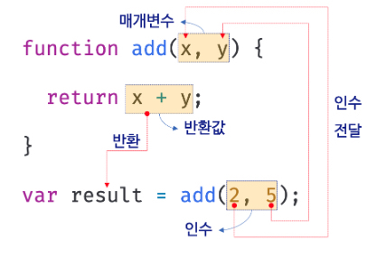
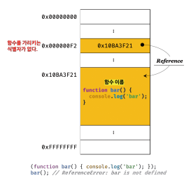
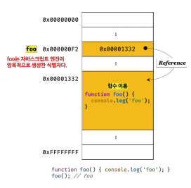

# 12장 함수

## 함수의 구성 요소  


```js
// 함수 정의
function add(x, y) {
  return x + y;
}

// 함수 호출
var result = add(2, 5);

console.log(result); // 7
```

#### 함수를 사용하는 이유

- 코드의 중복을 억제하고 재사용성을 높여 `유지보수`의 편의성을 높이고 실수를 줄여 코드의 신뢰성을 높이는 효과가 있음
- 적절한 함수 이름은 함수의 내부 코드를 이해하지 않고도 함수의 역할을 파악할 수 있게 도와 코드의 `가독성`을 향상시킴

### 함수 리터럴  
- 자바스크립트의 함수는 `객체 타입의 값` (일반 객체는 호출할 수 없지만 함수는 호출 가능)  
- 함수도 `함수 리터럴`로 생성함  
- 함수 리터럴은 `function 키워드`, `함수 이름`, `매개변수 목록`, `함수 몸체`로 구성됨

### 함수 정의  
- 함수를 호출하기 이전에 인수를 전달 받을 매개변수와 실행할 문들, 반환할 값을 지정하는 것  
- 정의된 함수는 자바스크립트 엔진에 의해 평가되어 함수 객체가 됨  

#### 함수 정의 방식

- 함수 선언문
- 함수 표현식
- Function 생성자 함수
- 화살표 함수

### 함수 선언문 
- 함수 선언문은 `함수 리터럴`과 형태가 동일함  
- 함수 선언문은 함수 이름을 생략할 수 ***없음***  
- 함수 선언문은 **표현식이 아닌 문**, 따라서 ***변수에 할당할 수 없음***

  ```js
  // 함수 선언문 or 함수 리터럴 표현식 ?
  var add = function add(x, y) {
    return x + y;
  };

  // 함수 호출
  console.log(add(2, 5)); // 7
  ```

  ***그러나 변수에 할당되는 것처럼 보임.. why?***   
  자바스크립트 엔진이 코드의 문맥에 따라 동일한 함수 리터럴을 표현식이 아닌 문인 `함수 선언문`으로 해석하는 경우와 표현식인 문인 `함수 리터럴 표현식`으로 해석하는 경우가 있기 때문

#### 함수 선언문 vs 함수 리터럴 표현식
자바스크립트 엔진은 함수 이름이 있는 함수 리터럴을 단독으로 사용하면 `함수 선언문`, 함수 리터럴이 값으로 평가되어야 하는 문맥이면 `함수 리터럴 표현식`으로 해석함

  ```js
  // 함수 선언문으로 해석됨
  // 함수 이름을 생략 불가능
  function foo() {
    console.log("foo");
  }
  foo(); // foo
  ```

  ```js
  // 함수 리터럴을 피연산자로 사용하면 함수 리터럴 표현식으로 해석됨
  // 함수 이름 생략 가능
  (function bar() {
    console.log("bar");
  });
  bar(); // ReferenceError..
  ```

  - 이유: 그룹 연산자 `()` 의 피연산자는 값으로 평가될 수 있는 `표현식`이어야 하기 때문 -> ***호출 불가능***   

  #### 위 예제에서 `foo()`는 되고 `bar()`는 안되는 이유
     
  여기에서 `bar`는 함수 내에서만 참조할 수 있는 식별자(=함수 이름), 함수 호출 X

    
  함수 선언문에서 `foo()` 가 가능한 이유 : 자바스크립트 엔진은 생성된 함수를 호출하기 위해 함수 이름과 동일한 이름의 식별자를 암묵적으로 생성하고, 거기에 함수 객체를 할당함  
  따라서 함수는 함수 이름으로 호출하는 것이 아니라 ***함수 객체를 가리키는 식별자로 호출함***   


### 함수 표현식  
- 자바스크립트의 함수는 일급 객체  
  >**일급 객체** : 값의 성질을 갖는 객체
- 함수 리터럴로 생성한 함수 객체를 ***변수에 할당 가능*** 
- 함수 표현식의 함수 리터럴은 함수 이름을 생략하는 것이 일반적

  ```js
  var add = function foo(x, y) {
    return x + y;
  };

  console.log(add(2, 5)); // 함수 객체를 가리키는 식별자로 호출
  console.log(foo(2, 5)); // ReferenceError...
  // foo는 함수 이름. 함수 이름은 함수 내부에서만 유효한 식별자
  ```

#### 함수 생성 시점과 함수 호이스팅

```js
// 함수 참조
console.dir(add); // ƒ add()
console.dir(sub); // undefined

// 함수 호출
console.log(add(2, 5)); // 7
console.log(sub(2, 5)); // TypeError..

// 함수 선언문
function add(x, y) {
  return x + y;
}

// 함수 표현식
var sub = function (x, y) {
  return x - y;
};
```
- 함수 선언문으로 정의한 함수는 함수 선언문 이전에 호출 가능 -> **함수 호이스팅** 
- 함수 표현식으로 정의한 함수는 함수 표현식 이전에 호출 불가능  
  -> 함수 선언문으로 정의한 함수와 함수 표현식으로 정의한 함수의 생성 시점이 다르기 때문

함수 선언문으로 함수를 정의하면 런타임 이전에 함수 객체가 먼저 생성되고, 함수 이름과 동일한 식별자에 함수 객체를 할당함

#### 변수 호이스팅 vs 함수 호이스팅  
- 둘다 런타임 이전에 자바스크립트 엔진에 의해 먼저 실행되어 식별자를 생성  
- `var` 키워드로 선언된 변수는 `undefined`로 초기화되고,  
함수 선언문을 통해 암묵적으로 생성된 식별자는 함수 객체로 초기화됨  
따라서 `var` 키워드를 사용한 변수 선언문 이전에 변수를 참조하면 **변수 호이스팅**에 의해 `undefined`로 평가되지만 함수 선언문으로 정의한 함수를 함수 선언문 이전에 호출하면 **함수 호이스팅**에 의해 호출 가능

<!-- 변수 선언은 런타임 이전에 실행되어 undefined로 초기화되지만 변수 할당문의 값은 할당문이 실행되는 시점, 즉 런타임에 평가되므로 함수 표현식의 함수 리터럴도 할당문이 실행되는 시점에 평가되어 함수 객체가 됨.  
따라서 함수 표현식으로 함수를 정의하면 함수 호이스팅이 발생하는 것이 아니라 변수 호이스팅이 발생함  
함수 표현식 이전에 함수를 참조하면 undefined로 평가됨. 따라서 이때 함수를 호출하면 undefined를 호출하는 것과 마찬가지이므로 타입 에러 발생. 따라서 함수 표현식으로 정의한 함수는 반드시 함수 표현식 이후에 참조 또는 호출해야 함 -->

### Function 생성자 함수  
Function 생성자 함수에 매개변수 목록과 함수 몸체를 문자열로 전달하면서 `new` 연산자와 함께 호출하면 함수 객체를 생성해서 반환함 (new 연산자 생략 가능)

```js
var add = new Function("x", "y", "return x + y");

console.log(add(2, 5)); // 7
```

함수 선언문이나 함수 표현식으로 생성한 함수와 Function 생성자 함수로 생성한 함수가 동일하게 동작하지 않는다

### 화살표 함수  
- `function` 키워드 대신 화살표 `=>`를 사용해 간략한 방법으로 함수를 선언함  
- 항상 익명 함수로 정의함

  ```js
  const add = (x, y) => x + y;
  console.log(add(2, 5)); // 7
  ```

### 함수 호출

  ```js
  // 함수 선언문
  function add(x, y) {
    return x + y;
  }

  // 함수 호출
  // 인수 1과 2가 매개변수 x, y 순서대로 할당되고 함수 실행됨
  add(1, 2); //

  // 매개변수의 스코프(유효범위)는 함수 내부
  console.log(x, y); // ReferenceError ...
  ```

인수가 부족해서 인수가 할당되지 않은 매개변수의 값은 `undefined`

```js
function add(x, y) {
  return x + y;
}

console.log(add(2)); // 2 + undefined = NaN
```

매개변수보다 인수가 더 많은 경우 초과된 인수는 무시됨

```js
function add(x, y) {
  return x + y;
}

console.log(add(2, 5, 10)); // 7
```

매개변수에 기본값 할당 가능  
매개변수에 인수를 전달하지 않을 경우 or `undefined`를 전달한 경우

  ```js
  function add(x = 0, y = 3) {
    return x + y;
  }

  console.log(add(2)); // 5
  console.log(add(undefined)); // 3
  ```

매개변수의 최대 개수
매개변수는 최대 3개 이상을 넘지 않는 것을 권장함

### 반환문

```js
function add(x = 0, y = 3) {
  return x + y; // 반환문
}

console.log(add(2)); // 5
console.log(add(undefined)); // 3
```

#### 반환문의 역할

함수의 실행을 중단하고 함수를 빠져나감   
  따라서, 반환문 이후 문은 실행되지 않고 무시됨   
`return` 키워드 뒤에 오는 표현식을 평가해 반환함 명시적인 표현식 없으면 `undefined`

  ```js
  function foo() {
    return;
  }

  console.log(foo()); // undefined
  ```

반환문 생략 가능

  ```js
  function foo() {
    //...
  }

  console.log(foo()); // undefined
  ```

`return` 키워드와 반환값으로 사용할 표현식 사이에 줄바꿈 있으면 세미콜론 자동 삽입 기능에 의해 세미콜론 추가됨

  ```js
  function multiply() {
    return
    x * y;
  }

  console.log(multiply(3, 5)); // undefined
  ```

반환문은 함수 내부에서만 사용 가능

## 다양한 함수의 형태  
### 즉시 실행 함수  
- 함수 정의와 동시에 즉시 호출되는 함수  
- 단 한 번만 호출되며 다시 호출 불가능
- 익명 함수를 사용하는 것이 일반적  
- 반드시 그룹 연산자 `(...)`로 감싸야 함

  ```js
  (function () {
    // ...
  });
  ```


### 재귀 함수  
- 함수가 자기 자신을 호출하는 함수   
- 재귀 함수는 자신을 무한 재귀 호출하므로 **탈출 조건**을 반드시 만들어야 함   
  ex. 팩토리얼
  ```js
  function factorial(n) {
    if (n <= 1) return 1;
    return n * factorial(n - 1);
  }
  console.log(factorial(3)); // 3!
  ```

### 중첩 함수(내부 함수)  
- 함수 내부에 정의된 함수   
- 중첩 함수를 포함하는 함수는 **외부 함수**   
- 중첩 함수는 외부 함수 내부에서만 호출할 수 있음   
  ```js
  function outer() {
    var x = 1;

    // 중첩 함수
    function inner() {
      var y = 2;
      // 외부 함수의 변수 참조 가능
      console.log(x + y);
    }

    inner();
  }

  outer();
  ```
### 콜백 함수   
- 함수의 매개변수를 통해 다른 함수의 내부로 전달되는 함수    
- **고차 함수** : 매개변수를 통해 함수의 외부에서 콜백 함수를 전달받은 함수를   
  ```js
  function repeat(n, f) {
    for (var i = 0; i < n; i++) {
      f(i);
    }
  }

  var logAll = function (i) {
    console.log(i);
  }

  repeat(5, logAll);
  ```
