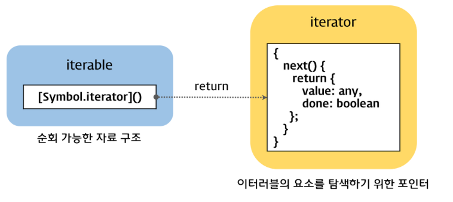
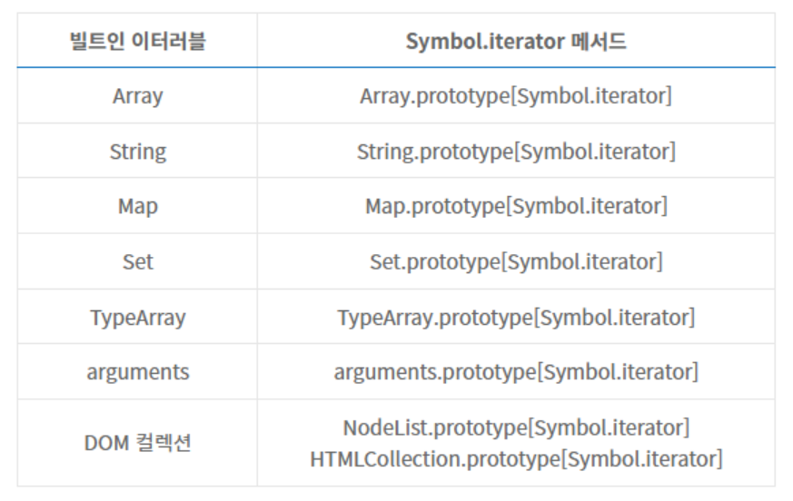

# 34장 이터러블

## 이터레이션 프로토콜

ES6에서 도입된 이터레이션 프로토콜은 순회 가능한 데이터 컬렉션(자료구조)을 만들기 위해 ECMAScript 사양에 정의하여 미리 약속한 규칙이다.  
ES6에서는 순회 가능한 데이터 컬렉션을 이터레이터 프로토콜을 준수하는 이터러블로 통일하여 for ... of문, 스프레드 문법, 배열 디스트럭처링 할당의 대상으로 사용할 수 있도록 일원화했다.

- 이터러블 프로토콜
- 이터레이터 프로토콜



### 이터러블

이터러블 프로토콜을 준수한 객체를 이터러블이라 한다.  
이터러블은 Symbol.iterator를 프로퍼티 키로 사용한 메서드를 직접 구현하거나 프로토타입 체인을 통해 상속받은 객체를 말한다.

```js
const array = [1, 2, 3];

// 배열은 Array.prototype의 Symbol.iterator 메서드를 상속받는 이터러블이다.
console.log(Symbol.iterator in array); // true

// 이터러블인 배열은 for...of 문으로 순회 가능하다.
for (const item of array) {
  console.log(item);
}

// 이터러블인 배열은 스프레드 문법의 대상으로 사용할 수 있다.
console.log([...array]); // [1, 2, 3]

// 이터러블인 배열은 배열 디스트럭처링 할당의 대상으로 사용할 수 있다.
const [a, ...rest] = array;
console.log(a, rest); // 1, [2, 3]
```

Symbol.iterator 메서드를 직접 구현하지 않거나 상속받지 않은 일반 객체는 이터러블 프로토콜을 준수한 이터러블이 아니다. 따라서 일반 객체는 for…of 문으로 순회할 수 없으며 스프레드 문법과 배열 디스트럭처링 할당의 대상으로 사용할 수 없다.

```js
const obj = { a: 1, b: 2 };

// 일반 객체는 Symbol.iterator 메서드를 구현하거나 상속받지 않는다.
// 따라서 일반 객체는 이터러블 프로토콜을 준수한 이터러블이 아니다.
console.log(Symbol.iterator in obj); // false

// 이터러블이 아닌 일반 객체는 for...of 문으로 순회할 수 없다.
for (const item of obj) {
  // -> TypeError: obj is not iterable
  console.log(item);
}

// 이터러블이 아닌 일반 객체는 배열 디스트럭처링 할당의 대상으로 사용할 수 없다.
const [a, b] = obj; // -> TypeError: obj is not iterable
```

### 이터레이터

이터러블의 Symbol.iterator 메서드를 호출하면 이터레이터 프로토콜을 준수한 이터레이터를 반환한다.

```js
// 배열은 이터러블 프로토콜을 준수한 이터러블이다.
const array = [1, 2, 3];

// Symbol.iterator 메서드는 이터레이터를 반환한다.
const iterator = array[Symbol.iterator]();

// Symbol.iterator 메서드가 반환한 이터레이터는 next 메서드를 갖는다.
console.log("next" in iterator); // true

// next 메서드를 호출하면 이터러블을 순회하며 순회 결과를 나타내는 이터레이터 리절트(result) 객체를 반환한다.
// 이터레이터 리절트 객체는 value와 done 프로퍼티를 갖는 객체다.
console.log(iterator.next()); // { value: 1, done: false }
console.log(iterator.next()); // { value: 2, done: false }
console.log(iterator.next()); // { value: 3, done: false }
console.log(iterator.next()); // { value: undefined, done: true }
```

- value 프로퍼티 : 현재 순회 중인 이터러블의 값을 나타냄
- done 프로퍼티 : 이터러블의 순회 완료 여부를 나타냄

## 빌트인 이터러블

자바스크립트는 이터레이션 프로토콜을 준수한 객체인 빌트인 이터러블을 제공한다.



## for ... of 문

for ... of 문은 이터러블을 순회하면서 이터러블의 요소를 변수에 할당한다.

```js
for (변수선언문 of 이터러블) { ... }

// 예시
for(const item of [1, 2, 3]) {
  // item 변수에 순차적으로 1, 2, 3이 할당된다.
  console.log(item); // 1 2 3
}
```

for ... of 문의 내부 동작을 for 문으로 표현하면 다음과 같다.

```js
const iterable = [1, 2, 3];

// 이터러블의 Symbol.iterator 메서드를 호출하여 이터레이터를 생성한다.
const iterator = iterable[Symbol.iterator]();

for (;;) {
  // ;; => 모든 구성 요소 생략, 무한 반복문 생성
  // 이터레이터의 next 메서드를 호출하여 이터러블을 순회한다.
  // 이때 next 메서드는 이터레이터 리절트 객체를 반환한다.
  const res = iterator.next();

  // next 메서드가 반환한 이터레이터 리절트 객체의 done 프로퍼티 값이 true이면 이터러블의 순회를 중단한다.
  if (res.done) break;

  // 이터레이터 리절트 객체의 value 프로퍼티 값을 item 변수에 할당한다.
  const item = res.value;
  console.log(item); // 1 2 3
}
```

## 이터러블과 유사 배열 객체

**유사 배열 객체**  
마치 배열처럼 인덱스로 프로퍼티 값에 접근할 수 있고 length 프로퍼티를 갖는 객체

유사 배열 객체는 이터러블이 아닌 일반 객체다.  
따라서 Symbol.iterator 메서드가 없기 때문에 for ... of 문으로 순회할 수 없다.

```js
const arrayLike = {
  0: 1,
  1: 2,
  2: 3,
  length: 3,
};

for (let i = 0; i < arrayLike.length; i++) {
  console.log(arrayLike[i]); //  1 2 3
}
```

`arguments`, `NodeList`, `HTMLCollection`은 유사 배열 객체이면서 이터러블이다.  
배열도 유사 배열 객체이면서 이터러블이다.  
(ES6에서 이터러블이 도입되면서 유사 배열 객체에 Symbol.iterator 메서드를 구현함)

모든 유사 배열 객체가 이터러블인 것은 아니다.  
다만 Array.from 메서드를 사용해 배열로 간단히 변환 가능하다.

```js
// 유사 배열 객체
const arrayLike = {
  0: 1,
  1: 2,
  2: 3,
  length: 3,
};

// Array.from 메서드는 유사 배열 객체(or 이터러블)을 인수로 전달받아 배열로 변환하여 반환함
const arr = Array.from(arrayLike);
console.log(arr); // [1, 2, 3]
```

## 사용자 정의 이터러블

이터레이션 프로토콜을 준수하지 않는 일반 객체도 이터레이션 프로토콜을 준수하도록 구현하면 사용자 정의 이터러블이 된다.
